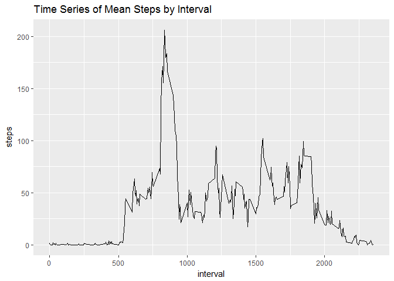
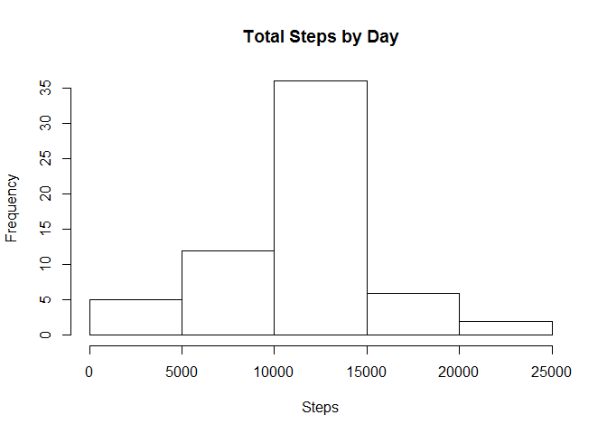
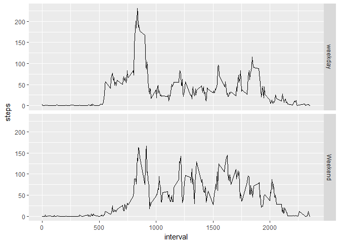

# Reproducible Research: Peer Assessment 1


## Loading and preprocessing the data


```r
library(ggplot2)
unzip("activity.zip")
activitydata <- read.csv("activity.csv", colClasses = c("numeric", "Date", "numeric"))
```

## What is mean total number of steps taken per day?

###Histogram of the sum of the steps based on date

```r
sumsteps <- aggregate(steps~date, activitydata, sum, na.action = na.omit)
hist(sumsteps$steps, main = "Total Steps per Day", xlab = "Steps")
```

<!-- -->

###Mean steps per date

```r
meansteps <- aggregate(steps~date, activitydata, mean)
print(meansteps)
```

```
##          date      steps
## 1  2012-10-02  0.4375000
## 2  2012-10-03 39.4166667
## 3  2012-10-04 42.0694444
## 4  2012-10-05 46.1597222
## 5  2012-10-06 53.5416667
## 6  2012-10-07 38.2465278
## 7  2012-10-09 44.4826389
## 8  2012-10-10 34.3750000
## 9  2012-10-11 35.7777778
## 10 2012-10-12 60.3541667
## 11 2012-10-13 43.1458333
## 12 2012-10-14 52.4236111
## 13 2012-10-15 35.2048611
## 14 2012-10-16 52.3750000
## 15 2012-10-17 46.7083333
## 16 2012-10-18 34.9166667
## 17 2012-10-19 41.0729167
## 18 2012-10-20 36.0937500
## 19 2012-10-21 30.6284722
## 20 2012-10-22 46.7361111
## 21 2012-10-23 30.9652778
## 22 2012-10-24 29.0104167
## 23 2012-10-25  8.6527778
## 24 2012-10-26 23.5347222
## 25 2012-10-27 35.1354167
## 26 2012-10-28 39.7847222
## 27 2012-10-29 17.4236111
## 28 2012-10-30 34.0937500
## 29 2012-10-31 53.5208333
## 30 2012-11-02 36.8055556
## 31 2012-11-03 36.7048611
## 32 2012-11-05 36.2465278
## 33 2012-11-06 28.9375000
## 34 2012-11-07 44.7326389
## 35 2012-11-08 11.1770833
## 36 2012-11-11 43.7777778
## 37 2012-11-12 37.3784722
## 38 2012-11-13 25.4722222
## 39 2012-11-15  0.1423611
## 40 2012-11-16 18.8923611
## 41 2012-11-17 49.7881944
## 42 2012-11-18 52.4652778
## 43 2012-11-19 30.6979167
## 44 2012-11-20 15.5277778
## 45 2012-11-21 44.3993056
## 46 2012-11-22 70.9270833
## 47 2012-11-23 73.5902778
## 48 2012-11-24 50.2708333
## 49 2012-11-25 41.0902778
## 50 2012-11-26 38.7569444
## 51 2012-11-27 47.3819444
## 52 2012-11-28 35.3576389
## 53 2012-11-29 24.4687500
```
###Median steps per date

```r
mediansteps <- aggregate(steps ~ date, activitydata, mean)
mediansteps
```

```
##          date      steps
## 1  2012-10-02  0.4375000
## 2  2012-10-03 39.4166667
## 3  2012-10-04 42.0694444
## 4  2012-10-05 46.1597222
## 5  2012-10-06 53.5416667
## 6  2012-10-07 38.2465278
## 7  2012-10-09 44.4826389
## 8  2012-10-10 34.3750000
## 9  2012-10-11 35.7777778
## 10 2012-10-12 60.3541667
## 11 2012-10-13 43.1458333
## 12 2012-10-14 52.4236111
## 13 2012-10-15 35.2048611
## 14 2012-10-16 52.3750000
## 15 2012-10-17 46.7083333
## 16 2012-10-18 34.9166667
## 17 2012-10-19 41.0729167
## 18 2012-10-20 36.0937500
## 19 2012-10-21 30.6284722
## 20 2012-10-22 46.7361111
## 21 2012-10-23 30.9652778
## 22 2012-10-24 29.0104167
## 23 2012-10-25  8.6527778
## 24 2012-10-26 23.5347222
## 25 2012-10-27 35.1354167
## 26 2012-10-28 39.7847222
## 27 2012-10-29 17.4236111
## 28 2012-10-30 34.0937500
## 29 2012-10-31 53.5208333
## 30 2012-11-02 36.8055556
## 31 2012-11-03 36.7048611
## 32 2012-11-05 36.2465278
## 33 2012-11-06 28.9375000
## 34 2012-11-07 44.7326389
## 35 2012-11-08 11.1770833
## 36 2012-11-11 43.7777778
## 37 2012-11-12 37.3784722
## 38 2012-11-13 25.4722222
## 39 2012-11-15  0.1423611
## 40 2012-11-16 18.8923611
## 41 2012-11-17 49.7881944
## 42 2012-11-18 52.4652778
## 43 2012-11-19 30.6979167
## 44 2012-11-20 15.5277778
## 45 2012-11-21 44.3993056
## 46 2012-11-22 70.9270833
## 47 2012-11-23 73.5902778
## 48 2012-11-24 50.2708333
## 49 2012-11-25 41.0902778
## 50 2012-11-26 38.7569444
## 51 2012-11-27 47.3819444
## 52 2012-11-28 35.3576389
## 53 2012-11-29 24.4687500
```

## What is the average daily activity pattern?

```r
meanstepsinterval <- aggregate(steps~interval, activitydata, mean)
```

###Average steps by interval across all days

```r
ggplot(meanstepsinterval, aes(interval, steps))  + 
        geom_line() +
        ggtitle("Time Series of Mean Steps by Interval")
```

<!-- -->

###Interval that saw the most average steps

```r
meanstepsinterval$interval[meanstepsinterval$steps == max(meanstepsinterval$steps)]
```

```
## [1] 835
```

## Imputing missing values

###Number of rows with NA values

```r
sum(is.na(activitydata$steps))
```

```
## [1] 2304
```

###Replace NA step values with their mean at the interval

```r
repdata <- activitydata
for (i in 1:nrow(repdata)){
if (is.na(repdata$steps[i]) == T){
        #avgst <- meanstep
        repdata$steps[i] <- meanstepsinterval$steps[repdata$interval[i] == meanstepsinterval$interval]

        }
}
```

###Total number of steps by day with imputed data

```r
hist(aggregate(steps~date, repdata, sum)$steps, main="Total Steps by Day", xlab = "Steps")
```

<!-- -->
## Are there differences in activity patterns between weekdays and weekends?
###Create a new variable that determines if a day is a weekday or not

```r
for(i in 1:nrow(repdata)) {
if(weekdays(repdata$date[i])=="Saturday" | weekdays(repdata$date[i])=="Sunday"){
        repdata$daytype[i] <- "Weekend"
} else {
        repdata$daytype[i] <- "weekday"
}
}
```
###Average steps by interval by weekday or weekend

```r
aggrepdata <- aggregate(steps~interval+daytype, repdata, mean)
ggplot(aggrepdata, aes( interval, steps)) +
        geom_line() + facet_grid(daytype ~ . )
```

<!-- -->
